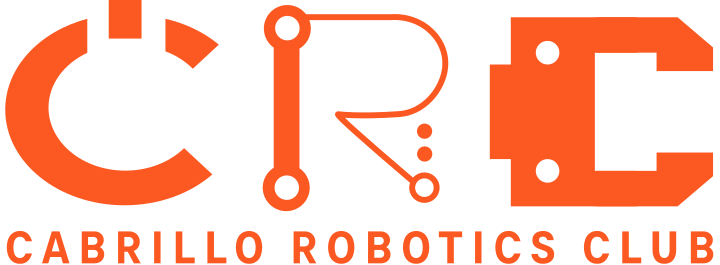

## SeaHawk II
SeaHawk is a project designed by a team of community college students from [Cabrillo College](https://www.cabrillo.edu/) in Aptos, California. Our latest project, SeaHawk II continues Cabrillo Robotics legacy of [SeaHawk I](https://github.com/CabrilloRoboticsClub/cabrillo_rov_2023/releases/tag/MATEROV-2023) and [Hydrozoa](https://github.com/CabrilloRoboticsClub/cabrillo_rov_2022) and will compete in the 2024 [MATE](https://materovcompetition.org/world-championship) International Competition. MATE challenges teams worldwide to build a Remotely Operated Vehicle (ROV) that can complete simulated real-world tasks underwater. Teams also demonstrate their robot's functionality and design rationale through marketing, documentation, a presentation, and more. Previously, Cabrillo Robotics has competed in the Pioneer division of the competition and took home first place the last two consecutive years. This year, we take on the challenge of developing a ROV to compete in the highest class of the competition: Explorer.

## Getting started developing
Are you new here? If so, welcome to Cabrillo Robotics Club! To get started developing for this project, the following documents will be useful.

| Documentation content | File |
| ---- | ---- | 
| Getting started developing | [`getting_started.md`](https://github.com/CabrilloRoboticsClub/cabrillo_rov_2023/blob/main/doc/getting_started.md) | 
| Running the project | [`run.md`](https://github.com/CabrilloRoboticsClub/cabrillo_rov_2023/blob/main/doc/run.md) | 

The resources below may be of additional assistance. 
| Resource | Link |
| ---- | ---- | 
| ROS2 Humble documentation | [ROS 2 Documentation: Humble Hawksbill](https://docs.ros.org/en/humble/index.html)
| Software team onboarding repo | [TinyHawk GitHub](https://github.com/CabrilloRoboticsClub/tiny_hawk)
| Software team onboarding videos | [TinyHawk YouTube Playlist](https://www.youtube.com/watch?v=hzFErKeImTs&list=PLrhUbqBwgd2hjlbSZ6VrAEFjsnTWKxhTc)

## Documentation
Documentation for the software in this repo is found in the [`doc`](https://github.com/CabrilloRoboticsClub/cabrillo_rov_2023/tree/main/doc) directory.

| Documentation content | File |
| ---- | ---- | 
| Project architecture | [`architecture.md` ](https://github.com/CabrilloRoboticsClub/cabrillo_rov_2023/blob/main/doc/architecture.md) | 
| Notes on the cameras| [`camera_notes.md`](https://github.com/CabrilloRoboticsClub/cabrillo_rov_2023/blob/main/doc/camera_notes.md) | 
| Getting started developing | [`getting_started.md`](https://github.com/CabrilloRoboticsClub/cabrillo_rov_2023/blob/main/doc/getting_started.md) | 
| Using Git/GitHub | [`github.md` ](https://github.com/CabrilloRoboticsClub/cabrillo_rov_2023/blob/main/doc/github.md) |
| ROS parameters and the SetRemoteParams class| [`params.md`](https://github.com/CabrilloRoboticsClub/cabrillo_rov_2023/blob/main/doc/params.md) | 
| Using and updating RViz | [`rviz.md`](https://github.com/CabrilloRoboticsClub/cabrillo_rov_2023/blob/main/doc/rviz.md) | 
| Running the project | [`run.md`](https://github.com/CabrilloRoboticsClub/cabrillo_rov_2023/blob/main/doc/run.md) | 
| Collecting and running ROS bags | [`ros_bags.md`](https://github.com/CabrilloRoboticsClub/cabrillo_rov_2023/blob/main/doc/ros_bags.md) | 
| Miscellaneous notes on the ROS packaging process | [`rosdep_notes.md`](https://github.com/CabrilloRoboticsClub/cabrillo_rov_2023/blob/main/doc/rosdep_notes.md) | 
| Project style guide (Python) | [`style_guide_python.md`](https://github.com/CabrilloRoboticsClub/cabrillo_rov_2023/blob/main/doc/style_guide_python.md) | 

