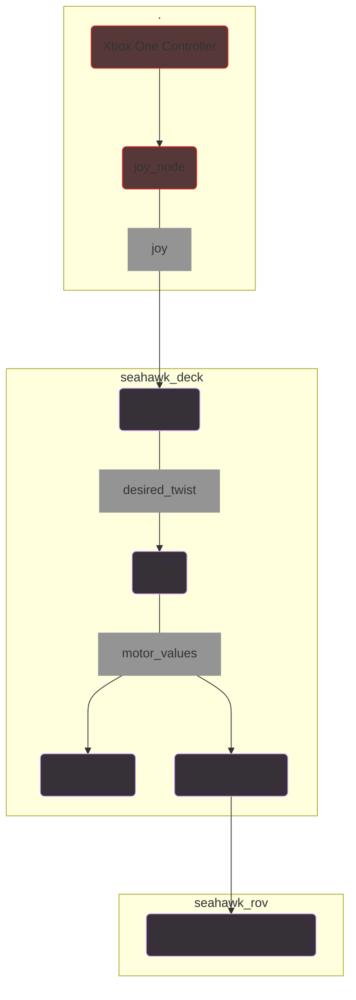

# Software Architecture

## Graph

```mermaid
flowchart TB
 subgraph seahawk_deck
        direction LR
        id_in --- id_desired_twist[desired_twist]:::top--> id_thrust(thrust):::node
        id_thrust--- id_motor_values[motor_values]:::top--->id_rviz(rviz_markers)
        id_motor_values ---> id_motor_encoding(motor_encoding):::node
    end

    subgraph seahawk_rov
        direction LR
        id_motor_encoding ---> id(aaaaaaaaaaaaaaaaaaaaa)
    end

    subgraph .
        direction TB
        id_xbox(Xbox One Controller):::out ---> id_joy_n(joy_node):::out
        id_joy_n(joy_node):::out --- id_joy_t[joy]:::top ---> id_in(pilot_input):::node
    end
    classDef node stroke:#CF9FFF, fill:#373038
    classDef out stroke:#F12626, fill:#573838
    classDef top fill:#949494, stroke:#949494
```