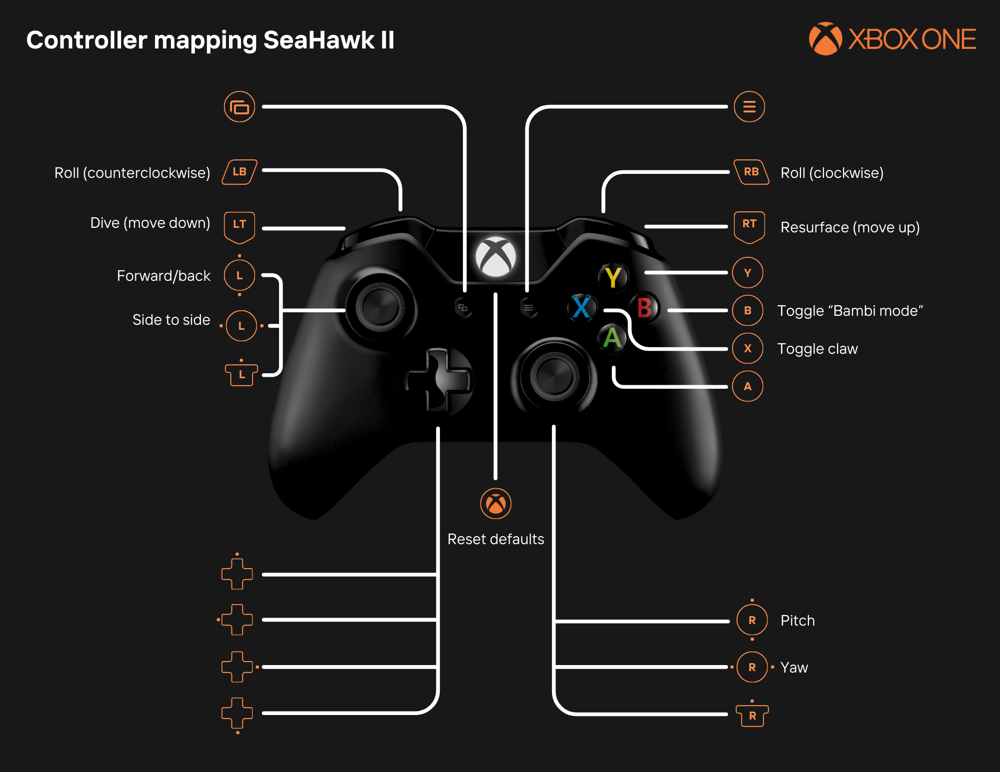

# Software Architecture
Much its predecessors, [SeaHawk I](https://github.com/CabrilloRoboticsClub/cabrillo_rov_202/releases/tag/MATEROV-2023) and [Hydrozoa](https://github.com/CabrilloRoboticsClub/cabrillo_rov_2022), SeaHawk II uses the Robot Operating System (ROS) for its modularity and tools for developing software for robotics. Specifically, SeaHawk II uses [ROS2 Humble](https://docs.ros.org/en/humble/index.html). ROS provides a framework in which nodes perform tasks and then communicate messages over topics. This document describes the organization of nodes, their function, and the topics over which they communicate.

## Graph

```mermaid
flowchart LR
 subgraph seahawk_deck
        direction LR
        id_in --- id_desired_twist[desired_twist]:::top--> id_thrust(thrust):::node
        id_thrust--- id_motor_values[motor_values]:::top--->id_rviz(rviz_markers)
        id_motor_values ---> id_motor_encoding(motor_encoding):::node
    end

    subgraph seahawk_rov
        direction LR
        debug_id(debug)
    end

    subgraph external
        direction TB
        id_xbox(Xbox One Controller):::out ---> id_joy_n(joy_node):::out
        id_joy_n(joy_node):::out --- id_joy_t[joy]:::top ---> id_in(pilot_input):::node
    end
    classDef node stroke:#9172f8, fill:#373038
    classDef out stroke:#F12626, fill:#573838
    classDef top fill:#949494, stroke:#949494
```


## Nodes

### joy_node
- **Publishes to:** [`/joy`](http://docs.ros.org/en/api/sensor_msgs/html/msg/Joy.html)

**Run the node:**
```console
 ros2 run joy joy_node
```

**Description:**
The `joy_node` node from the [joy](http://wiki.ros.org/joy) package reads input from a Linux joystick controller and publishes it to the `/joy` topic. The message of type `Joy` contains the current state of the joystick buttons and axes in two arrays. The buttons and axes of an Xbox One are mapped in the following configuration for an Xbox One Controller:

<table>
<tr><th colspan=2 style="text-align: center">Xbox One Controller</th></tr>
<tr><th style="text-align: center"> buttons array</th><th style="text-align: center">axes array</th></tr>
<tr><td>

| Index | Button | 
| ----- | ------ | 
| 0 | A | 
| 1 | B |
| 2 | X | as
| 3 | Y | 
| 4 | LB | 
| 5 | RB |
| 6 | Window | 
| 7 | Menu | 
| 8 | Xbox | 
| 9 | Left stick press | 
| 10 | Right stick press | 

</td><td valign="top">

| Index | Axes | 
| ----- | ---- | 
| 0 | Left stick x |
| 1 | Left stick y | 
| 2 | LT | 
| 3 | Right stick x | 
| 4 | Right stick y | 
| 5 | RT | 
| 6 | Dpad x | 
| 7 | Dpad y | 

</td></tr> <table>


---
### pilot_input
- **File:** [`pilot_input.py`](https://github.com/CabrilloRoboticsClub/cabrillo_rov_2023/blob/main/src/seahawk/seahawk_deck/pilot_input.py)
- **Subscribes to:** [`/joy`](http://docs.ros.org/en/api/sensor_msgs/html/msg/Joy.html)
- **Publishes to:** `/desired_twist`, `/claw_state`
- **Parameters:** `throttle_curve_choice`

**Run the node:**
```console
 ros2 run seahawk pilot_input
```

**Description:** The `pilot_input` node subscribes to the `/joy` topic, mapping `Joy` message contents to its functionality piloting the robot. Values from the controller are modified if requested, and then republished to topics. 

The bumpers and sticks (axes) are mapped to driving the robot in linear and angular space. From these values, a [`Twist`](http://docs.ros.org/en/melodic/api/geometry_msgs/html/msg/Twist.html) message is created specifying the direction ($\pm$ linear/angular x, y, z) and percent of max throttle the pilot wants the robot to move. The throttle may be modified from default by initiating bambi mode and by using throttle curves. Bambi mode cuts all inputs in half for precise movements. Throttle curves change the relationship between the position of the stick and the amount of throttle produced. The pilot may choose a throttle curve using the keyboard, which remotely updates the curve selection on this node using parameters. 

Additionally, buttons on the controller contribute to the behavior of the robot. This includes triggering the claw, whose state is published to the`claw_state` topic. The complete controller mapping can be found below.



---
### thrust
- **File:** [`thrust.py`](https://github.com/CabrilloRoboticsClub/cabrillo_rov_2023/blob/main/src/seahawk/seahawk_deck/thrust.py)
- **Subscribes to:** `/desired_twist`
- **Publishes to:** `/motor_values`
- **Parameters:** `center_of_mass_offset`

**Run the node:**
```console
 ros2 run seahawk thrust
```

**Description:** The `thrust` node converts a `Twist` message specifying the pilot's desired direction ($\pm$ linear/angular x, y, z) and percent of max throttle into the amount of thrust in Newtons each motor should produce.

---

### rviz_markers
- **File:** [`rviz_markers.py`](https://github.com/CabrilloRoboticsClub/cabrillo_rov_2023/blob/architecture/src/seahawk/seahawk_deck/rviz_markers.py)
- **Subscribes to:** `/motor_values`
- **Publishes to:** `/motor_debug`
- **See:** [rviz.md](https://github.com/CabrilloRoboticsClub/cabrillo_rov_2023/blob/architecture/doc/rviz.md)

**Run the node:**
```
# Run the node
ros2 run seahawk rviz_markers

# Launch Rviz
ros2 launch seahawk kinematics_viz.launch.py
```

**Description:** [Rviz](http://wiki.ros.org/rviz) (ROS Visualization) is a 3D tool which enables developers to view the functionality of a robot virtually. This is useful for software development before the physical robot is completed or for remote work. The `rviz_markers` node uses RViz to visualize water propulsion from the motors.

--- 

### debug_node
- **File:** [`debug.py`](https://github.com/CabrilloRoboticsClub/cabrillo_rov_2023/blob/main/src/seahawk/seahawk_rov/debug.py)
- **Publishes to:** `/debug_info`

**Run the node:**
```
ros2 run seahawk debug
```

**Description:** Publishes diagnostic information from the Raspberry Pi. The message published to `/debug_info` contains the following contents 
| Type | Name | Description | 
|:----| :---- | :---------- | 
| `float64` | `cpu_usage` | The CPU usage in %| 
| `float64` | `memory_usage` | The memory usage in %| 
| `float64` | `cpu_temperature` | The CPU temperature in C| 
| `string` | `net_sent` | The number of bytes sent, string contains denomination| 
| `string` | `net_recv` | The number of bytes received, string contains denomination | 
| `float64` | `time` | The time of when measurements were read | 

