# Software Architecture
Much its predecessors, [SeaHawk](https://github.com/CabrilloRoboticsClub/cabrillo_rov_2023/releases/tag/MATEROV-2023) and [Hydrozoa](https://github.com/CabrilloRoboticsClub/cabrillo_rov_2022), SeaHawk II uses The Robot Operating System (ROS). Specifically, SeaHawk II uses [ROS2 Humble](https://docs.ros.org/en/humble/index.html) for its modularity and tools for developing software specifically to robotics. ROS uses a framework in which nodes preform tasks then communicate messages over topics. 

## Graph

```mermaid
flowchart TB
 subgraph seahawk_deck
        direction LR
        id_in --- id_desired_twist[desired_twist]:::top--> id_thrust(thrust):::node
        id_thrust--- id_motor_values[motor_values]:::top--->id_rviz(rviz_markers)
        id_motor_values ---> id_motor_encoding(motor_encoding):::node
    end

    subgraph seahawk_rov
        direction LR
        id_motor_encoding ---> id(aaaaaaaaaaaaaaaaaaaaa)
    end

    subgraph .
        direction TB
        id_xbox(Xbox One Controller):::out ---> id_joy_n(joy_node):::out
        id_joy_n(joy_node):::out --- id_joy_t[joy]:::top ---> id_in(pilot_input):::node
    end
    classDef node stroke:#CF9FFF, fill:#373038
    classDef out stroke:#F12626, fill:#573838
    classDef top fill:#949494, stroke:#949494
```


## Nodes

### joy_node
- **Publishes to:** [`/joy`](http://docs.ros.org/en/api/sensor_msgs/html/msg/Joy.html)

**Run the node:**
```console
 ros2 run joy joy_node
```

**Description:**
The `joy_node` node from the [joy](http://wiki.ros.org/joy) package reads input from a Linux joystick controller and publishes it to the `/joy` topic. The message of type `Joy` contains the current state of the joystick buttons and axes in two arrays. The buttons and axes of an Xbox One are mapped in the following configuration for an Xbox One Controller:

<table>
<tr><th colspan=2 style="text-align: center">Xbox One Controller</th></tr>
<tr><th style="text-align: center"> buttons array</th><th style="text-align: center">axes array</th></tr>
<tr><td>

| Index | Button | 
| ----- | ------ | 
| 0 | A | 
| 1 | B |
| 2 | X | as
| 3 | Y | 
| 4 | LB | 
| 5 | RB |
| 6 | Window | 
| 7 | Menu | 
| 8 | Xbox | 
| 9 | Left stick press | 
| 10 | Right stick press | 

</td><td valign="top">

| Index | Axes | 
| ----- | ---- | 
| 0 | Left stick x |
| 1 | Left stick y | 
| 2 | LT | 
| 3 | Right stick x | 
| 4 | Right stick y | 
| 5 | RT | 
| 6 | Dpad x | 
| 7 | Dpad y | 

</td></tr> <table>


---
### pilot_input
- **File:** [`pilot_input.py`](https://github.com/CabrilloRoboticsClub/cabrillo_rov_2023/blob/main/src/seahawk/seahawk_deck/pilot_input.py)
- **Subscribes to:** [`/joy`](http://docs.ros.org/en/api/sensor_msgs/html/msg/Joy.html)
- **Publishes to:** `/desired_twist`, `/claw_state`

**Run the node:**
```console
 ros2 run seahawk pilot_input
```

**Description:**
