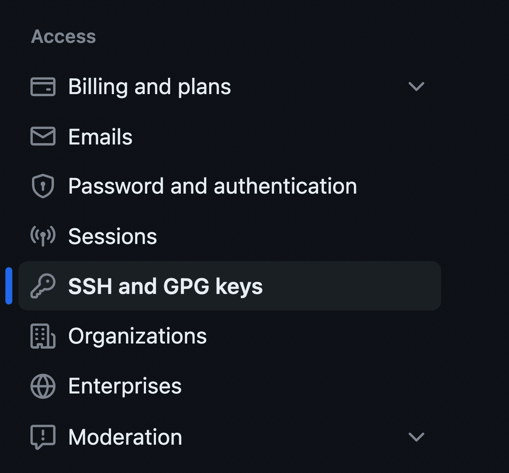

# Using Git and GitHub
## 1 Installing git
1. By default, git should be installed.
2. Confirm git is installed by running the following command in your terminal.
    ```sh
    git --version
    ```
    You should get back something that looks like `git version 2.39.0`
3. If you did not get a version number, follow the this guide: [Install Git](https://git-scm.com/book/en/v2/Getting-Started-Installing-Git).


## 2 Create a GitHub account
GitHub is the free web based platform we and many other software engineers use to share and collaborate on projects as well as control version history.

1. Go to [GitHub](https://github.com/) and follow the steps to create an account.
    
    Note: As a Cabrillo student, you can get a bunch of free goodies from GitHub Education. For now, you should continue following this guide, but later, don't forget to go to [education.github.com](https://education.github.com/). You will have to add your `STUDENTID@student.cabrillo.edu` email (it's a Gmail account).
2. Return to the terminal to configure git.
3. Set up your username using the following command where `<your_GitHub_username>` is the username you chose when creating your GitHub account
    ```sh
    git config --global user.name <your_GitHub_username>
    ```
4. Set up your email using the following command where `<your_GitHub_email>` is the email you used when creating your GitHub account
    ```sh
    git config --global user.email <your_GitHub_email>
    ```


## 3️ Generate an SSH key
1. Generate an SSH key to connect your system to your GitHub account if you do not already have one.
    ```sh
    ssh-keygen -t ed25519
    ```
    - When it asks for the file location, press enter to save it to the default location (`~/.ssh`).
    - Hit enter when it asks for the password to not save a password or enter one if you think you can remember it.
2. Copy the generated ssh key
    ```sh
    cat ~/.ssh/id_ed25519.pub
    ```


## 4 Add the SSH key to GitHub
1. Return to GitHub and open your [settings](https://github.com/settings/) by clicking on your icon then ⚙️ `settings`
2. Scroll to  🔑 `SSH and GPG keys`

   

4. Click the  button located in the top right corner.
1. Choose a name for the key (something such that you'll remember what computer/system it was for)
2. Paste the key from step 2 into the `Key` box
3. Save the key by clicking 


## 5️ Clone the repository to your system
1. Return to your terminal and navigate using `cd` to where you would like this repo's contents to live with your file system.
2. Clone the repo and its sub modules.
    ```sh
    git clone git@github.com:CabrilloRoboticsClub/cabrillo_rov_2023.git
    cd ~/cabrillo_rov_2023
    git submodule init 
    git submodule update
    ```
3. To confirm the clone was successful list your files with `ls`. You should see the name of the cloned repo in your current directory.


# Development using git

## 0️ Sync and pull the changes
1. Next navigate to the repo on your system
2. Enter the command `git pull` to pull the changes on GitHub onto your device
   ```sh
   git pull origin main
   ```

## 1️ Make a branch
1. Pull the meta data from the remote repo to update the remote branches
    ```sh
    git fetch
    ```
2. Create a branch.
    ```sh
    git checkout -b branch_name
    ```

## 2️ Add and commit your changes
Once you make some changes you would like to be documented you need to `commit` them. Committing changes is how you can mark versions of your code you would like to be tracked. It is a good idea to commit changes after you add/remove a feature that way there is a record of your changes. 
1. Add all files you wish to commit with `git add`. All files you all will be committed under the same commit
    ```
    git add my_file.py
    ```
1. To commit changes you use the `git commit` command. The parts of the command are as follows:
     - `git`: Denotes we are using a git command 
     - `commit`: The name of the command is commit, this is what we would like to do
     - `-m`: This is a flag that says we would like to add a commit message
     - `"Message here`: Between quotes state what changes you are committing 
     
     All together the git commit command syntax looks like this:
     ```sh
     git commit -m "Message here"
     ```
     If you want to write a longer commit message use the `-v` flag. This will open a CLI editor.
     ```sh
     git commit -v
     ```
2. You will receive a short message summarizing the changes

<br>

## 3️ Push your changes
Once you have finished a coding session it is a good idea to `push` your commits. The `push` command is basically the opposite of `pull`. `push` takes the changes (commits) you made on your local system and sends them to GitHub.
1. Enter the command `git push origin branch_name` to push the changes from your system to GitHub where `branch_name` is the name of the branch you are on
    ```
    git commit origin branch_name
    ```
2. You can confirm this worked by heading to Github and seeing the changes reflected on your repo page.

## 4️ Create a pull request
When you think your code is ready to merge into the main Cabrillo Robotics Code create a pull request. 
1. Go to the pull requests page on GitHub and click on .
2. Select your branch as the branch to compare to.
3. Add a description of what changes you made and why.

# What are Git and GitHub
## Recording 
*Click on the image to open the [video](https://youtu.be/hzFErKeImTs)*
[](https://youtu.be/Opt-DSF9d_Y?si=3k5_N0q704sF5LPl "Tiny Hawk: What are Git and GitHub")
