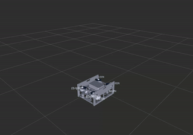

# RViz

## Introduction
[Rviz](http://wiki.ros.org/rviz) (ROS Visualization) is a 3D tool which enables developers to view the functionality of a robot virtually. This is useful for software development before the physical robot is completed or for remote work. Our project uses RViz to visualize water flow from the motors.



## Running RViz
Launch RViz.

```sh
ros2 launch seahawk rviz.launch.py
```

A window with the RViz simulation should open automatically.

## Maintaining/updating Rviz model

### 1 URDF Export Procedure for SolidWorks
**Note:** Installing two versions of SolidWorks on the same system may cause corruption issues. It's recommended to uninstall any previous versions before installing a new one.

#### Prerequisites
- SolidWorks 2020 or 2021 installed on your system.
- URDF Exporter plugin for SolidWorks 2020: [Download Plugin](https://github.com/ros/solidworks_urdf_exporter/releases/tag/1.6.0).

#### 1.1 Install the URDF Exporter Plugin

- Download the SolidWorks 2020 version of the URDF Exporter plugin from the provided link.
- Install the plugin according to the instructions provided in the plugin package.
- Restart SolidWorks after the installation.
- Access the plugin from the bottom of the tools list in SolidWorks.

#### 1.2 Prepare the SolidWorks Model

- Ensure your SolidWorks model is correctly constructed with all necessary components and joints defined.
- Export the top-level assembly as a single part file.
- Open the exported file and remove unnecessary features until the file size is acceptable.

#### 1.3 Export as .STEP File

- Save the modified model as a `.STEP` file.
- Navigate to **File > Save As** and select the `.STEP` format.

#### 1.4 Import .STEP File into SolidWorks 2021

- Open SolidWorks 2021.
- Import the `.STEP` file exported from SolidWorks 2023 or newer.
- Verify that the model is intact and functions as expected.

#### 1.5 Insert into Assembly and Mate Plane Relative to Center of Mass

- Insert the part into the assembly.
- Ensure that you mate the planes relative to the center of mass, not the centroid, for accurate positioning.

#### 1.6 Edit SolidWorks Configuration File export_params_mesh.xml

- Locate the `export_params_mesh.xml` file in the SolidWorks URDF Exporter plugin folder.
- Enable extra coarse mesh by adjusting the corresponding parameters.
- Scale the `maximum_mesh_interp` value by 150% to reduce mesh quality (This is the farthest I was able to push it without problems).

#### 1.7 Launch Export Plugin and Define Baseline with Rigid Connection

- Launch the URDF Exporter plugin.
- Define the single part as a baseline with a rigid connection.
- Select the most reduced mesh option in the export wizard.
- Keep the parameters {`Ix`, `Iy`, `Iz`} as they are and click `export URDF` to proceed.

### 2 Import files to the project
Most RViz related files are found in [`seahawk_description`](https://github.com/CabrilloRoboticsClub/cabrillo_rov_2023/tree/main/src/seahawk_description). This is where the files from SolidWorks will be added. Of these files, the majority can remain untouched when updating to a new model. The files which must be updated include `base_link.STL`, `seahawk_description.csv` and `seahawk_description.urdf`, the remaining can and should remain unmodified.


#### 2.1 Update STL file
- Replace the old `base_link.STL` with the new `.STL` file generated by SolidWorks. 
- Ensure the file retains the same name, `base_link.STL`
#### 2.2 Update urdf and csv file
- In the `urdf` directory, update the `.csv` and `.urdf` files with the new versions. 
- Within these files, search for any file paths and modify them if necessary. For example, this path to the `.STL` file needed to be updated from the default from SolidWorks.
    ```xml
    <geometry>
        <mesh filename="package://seahawk_description/meshes/base_link.STL" />
    </geometry>
    ```
- Ensure the files retain the names, `seahawk_description.csv` and `seahawk_description.urdf`

### 3 Update `rviz_markers.py` motor config
[`rviz_markers.py`](https://github.com/CabrilloRoboticsClub/cabrillo_rov_2023/blob/main/src/seahawk/seahawk_deck/rviz_markers.py) is responsible for creating [Markers](http://wiki.ros.org/rviz/DisplayTypes/Marker) which display the thrust vectors in RViz. For a new model, the `MOTORS` list must be updated with updated motor positions and rotation.
```py
# Position and angle constants for top motors (0-3)
X_TOP = 0.2
Y_TOP = 0.13
Z_TOP = 0.004
P_TOP = -pi / 2
# Position constants for bottom motors (4-7)
X_BOT = 0.102
Y_BOT = 0.152
Z_BOT = -0.052

# Position: (x, y, z),         Rotation: (Roll, Pitch, Yaw)
MOTORS = [
    ((-X_TOP,  Y_TOP, Z_TOP), (0, P_TOP, 0)),            # 0 (Top)
    ((-X_TOP, -Y_TOP, Z_TOP), (0, P_TOP, 0)),            # 1 (Top)
    (( X_TOP,  Y_TOP, Z_TOP), (0, P_TOP, 0)),            # 2 (Top)
    (( X_TOP, -Y_TOP, Z_TOP), (0, P_TOP, 0)),            # 3 (Top)
    ((-X_BOT,  Y_BOT, Z_BOT), (0, 0,     pi     / 4)),   # 4 (Bottom)
    ((-X_BOT, -Y_BOT, Z_BOT), (0, 0,     7 * pi / 4)),   # 5 (Bottom)
    (( X_BOT,  Y_BOT, Z_BOT), (0, 0,     3 * pi / 4)),   # 6 (Bottom)
    (( X_BOT, -Y_BOT, Z_BOT), (0, 0,     5 * pi / 4)),   # 7 (Bottom)    
]
NUM_MOTORS = 8
```
Modify the position constants and angles to match the new model. The measurements are in meters and angles in radians.
