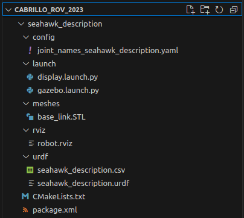

# RViz

## Introduction
[Rviz](http://wiki.ros.org/rviz) (ROS Visualization) is a 3D tool which enables developers to view the functionality of a robot virtually. This is useful for software development before the physical robot is completed or for remote work. Our project uses RViz to visualize the thrust vectors of the motors.


## Running RViz
1. Launch the deck or run relevant nodes independently. If running individual nodes, be sure to also run the node which is responsible for creating and displaying the force vectors
    ```sh
    ros2 run seahawk rviz_marker
    ```
2. Launch RViz
    ```sh
    ros2 launch seahawk kinematics_viz.launch.py
    ```
3. A window with the RViz simulation should open automatically

## Maintaining/updating Rviz

### 1. Export files from SolidWorks
*Isaac add stuff here*

### 2. Import files to the project
Most RViz related files are found in [`seahawk_description`](https://github.com/CabrilloRoboticsClub/cabrillo_rov_2023/tree/main/src/seahawk_description). This is where the files from SolidWorks will be added. Of these files, the majority can remain untouched when updating to a new model. The files which must be updated include `base_link.STL`, `seahawk_description.csv` and `seahawk_description.urdf`, the remaining can and should remain unmodified.



1. Replace the old `base_link.STL` with the new `.STL` file generated by SolidWorks. Ensure the file retains the same name.
2. In the `urdf` directory, update the `.csv` and `.urdf` files with the new versions. Within these files, search for any paths and modify them if necessary. For example, this path to the `.STL` file may need to be updated from the default from SolidWorks
    ```xml
    <geometry>
        <mesh filename="package://seahawk_description/meshes/base_link.STL" />
    </geometry>
    ```
    Ensure the files retain the names, `seahawk_description.csv` and `seahawk_description.urdf`

### 3. Update `rviz_markers.py` motor config
[`rviz_markers.py`](https://github.com/CabrilloRoboticsClub/cabrillo_rov_2023/blob/main/src/seahawk/seahawk_deck/rviz_markers.py) is responsible for creating [Markers](http://wiki.ros.org/rviz/DisplayTypes/Marker) which display the thrust vectors in RViz. For a new model, the `MOTORS` list must be updated with updated motor positions and rotation.
```py
# Position and angle constants for top motors (0-3)
X_TOP = 0.19
Y_TOP = 0.12
Z_TOP = 0.047
P_TOP = pi / 2
# Position constants for bottom motors (4-7)
X_BOT = 0.105
Y_BOT = 0.15
Z_BOT = -0.038

# Position: (x, y, z),         Rotation: (Roll, Pitch, Yaw)
MOTORS = [
    ((-X_TOP,  Y_TOP, Z_TOP), (0, P_TOP, 0)),            # 0 (Top)
    ((-X_TOP, -Y_TOP, Z_TOP), (0, P_TOP, 0)),            # 1 (Top)
    (( X_TOP,  Y_TOP, Z_TOP), (0, P_TOP, 0)),            # 2 (Top)
    (( X_TOP, -Y_TOP, Z_TOP), (0, P_TOP, 0)),            # 3 (Top)
    (( X_BOT,  Y_BOT, Z_BOT), (0, 0,     3 * pi / 4)),   # 4 (Bottom)
    (( X_BOT, -Y_BOT, Z_BOT), (0, 0,     5 * pi / 4)),   # 5 (Bottom)    
    ((-X_BOT,  Y_BOT, Z_BOT), (0, 0,     pi     / 4)),   # 6 (Bottom)
    ((-X_BOT, -Y_BOT, Z_BOT), (0, 0,     7 * pi / 4)),   # 7 (Bottom)
]
NUM_MOTORS = 8
```
Modify the position constants and angles to match the new model. The measurements are in meters and angles in radians.