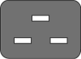
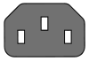
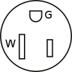
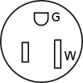
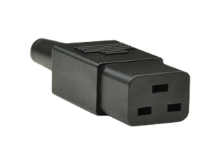
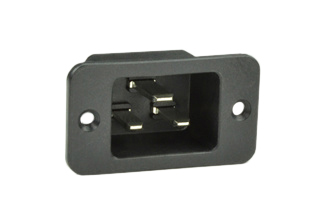
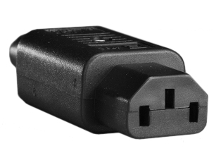
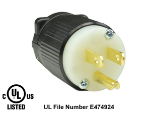
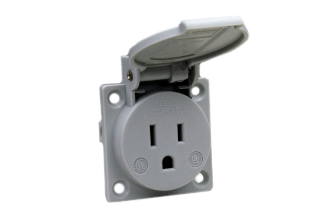

*from 2023*
# Setup Procedure

This is the procedure to use for our 5 minutes alloted setup time at the competition

Person 1 and person 2 work in parallel

## Person 1 (Ciaran or Orion)

1. Setup the DECK BOX

    1. Open the Deck box on table in front of the pilot.

    1. Look through lexan sheet for loose connectors.

    1. Wifi Antennas to RP-SMA Jacks

    1. Deck Box Power Cable (IEC-C13 / NEMA 5-15P) to an Extension Cord Outlet (NEMA 5-15R)

    1. Deck box Power cable (IEC-C13) to the Deck Box "POWER IN" (IEC-C14)

    1. Flip the "POWER IN" switch to "ON"

    1. Monitor USB-C to "MONITOR PSU"

    1. (If Available) WAN Ethernet to "WAN"

## Person 2 (Tether Manager)

1. Connect the rov side of the tether rov.
    * strain relief to the frame
    * ethernet to the logic tube
    * pneumatic to the pneumatic line
    * 48V power to the thrust box

1. Connect the deck side of the tether.
    * strain relief to the table
    * SBS50 to the 48v PSU
    * Ethernet to the "ROV LAN" port on the deck box
    * pneumatic line to the compressor

1. Connect and turn on the ROV 48V Power Supply.

    1. 48V PSU Power Cable (IEC-C19 / NEMA 5-15P) to an Extension Cord Outlet (NEMA 5-15R.)
    1. 48V PSU Power Cable (IEC-C19) to the 48V PSU "POWER IN" (IEC-C20)
    1. Flip the "INPUT SW" to "I"
    1. Flip the "OUTPUT SW" to "ON"

## Person 1 (Ciaran or Orion) (part 2)

1. Wait for the monitor to show the Ubuntu Desktop.

1. On the Keyboard use the `ctrl`+`alt`+`t` keyboard shortcut 3 times to open 3 Terminal windows

1. in the first window launch the deck

```console
source ~/cabrillo_rov_2023/install/setup.bash && ros2 launch seahawk_deck deck.launch.py
```

1. In the second window ssh into the rov

```console
ssh ubuntu@SeaHawk-ROV.lan
```

1. In the second window launch the ROV

```console
source ~/cabrillo_rov_2023/install/setup.bash && ros2 launch seahawk_rov rov.launch.py
```

1. In the third window open rqt

```console
source ~/cabrillo_rov_2023/install/setup.bash && rqt
```

## YOU ARE READY TO DRIVE THE ROV

## Reference Images

| IEC-C19 | IEC-C20 | IEC-C13 | IEC-C14 | NEMA 5-15P | NEMA 5-15R |
|---------|---------|---------|---------|------------|------------|
|  |  |  |  |  | 
|  |  |  |  |  |  |
