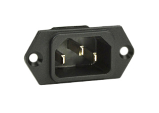

# Setup Procedure

This is the procedure to use for our 5 minutes alloted setup time at the competition

Person 1 and person 2 work in parallel

## Person 1 (Ciaran or Orion)

1. Setup the DECK BOX

    1. Open the Deck box on table in front of the pilot.

    1. Look through lexan sheet for loose connectors.

        * [wiring diagram](example.com)

    1. Wifi Antennas to RP-SMA Jacks

    1. IEC-C13 / NEMA 5-15P Cable to NEMA 5-15R (Wall Power)

    1. IEC-C13 cable to the IEC-C14 "POWER IN" (on deck box)

    1. Flip the "POWER IN" switch to "ON"

    1. Plug the monitor into its power supply (USB-C cable).

    1. If WAN is available, connect it to the "WAN" port.

## Person 2 (Tether Manager)

1. Connect the rov side of the tether rov.
    * strain relief
    * ethernet
    * pneumatic
    * 48V power

1. Connect the deck side of the tether.
    * strain relief to the table
    * SBS50 to the 48v PSU
    * Ethernet to the "ROV LAN" port on the deck box
    * pneumatic line to the compressor

1. Connect and turn on the ROV power Supply.

    1. IEC-C19 / NEMA 5-15P cable to the NEMA 5-15R (Wall Power)
    1. IEC-C19 Cable to the IEC-C20 socket on the psu (POWER IN)
    1. Flip the "INPUT SW" to "I" on the 48V PSU
    1. Flip the "OUTPUT SW" to "ON" on the 48V PSU

## Person 1 (Ciaran or Orion) (part 2)

1. Wait for the monitor to show the Ubuntu Desktop.

1. On the Keyboard use the `ctrl+alt+t` keyboard shortcut to open a Terminal window

1. Open 2 more tabs with the new tab button in the top left so there are 3 tabs are open

1. in the first tab launch the deck

```console
source ~/cabrillo_rov_2023/install/setup.bash && ros2 launch seahawk_deck deck.launch.py
```

1. In the second tab ssh into the rov

```console
ssh ubuntu@SeaHawk-ROV.lan
```

1. In the second tab launch the ROV

```console
source ~/cabrillo_rov_2023/install/setup.bash && ros2 launch seahawk_rov rov.launch.py
```

1. In the third tab open rqt

```console
source ~/cabrillo_rov_2023/install/setup.bash && rqt
```

## YOU ARE READY TO DRIVE THE ROV

## Reference Images

| IEC-C19 | IEC-C20 | IEC-C13 | IEC-C14 | NEMA 5-15P | NEMA 5-15R |
|---------|---------|---------|---------|------------|------------|
|  |  |  |  |  | 
|  |  |  |  | |
